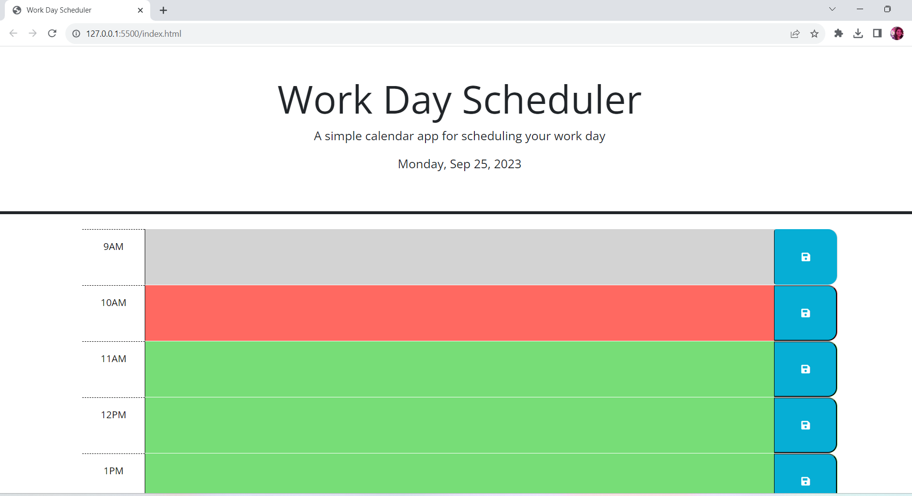

# Work Day Calendar

## Description
As a full stack web developer, I want to create a daily planner for an employee with a busy schedule to add important events so that he/she can manage his/her time effectively.

# Usage 
To use this daily planner to create a schedule, first, open the application.  The current day will be displayed at the top of the calendar.  When you scroll down, you will be presented with time blocks for standard business hours of 9am to 5pm.  View the time blocks for that day. Each time block is color-coded to indicate whether it is in the past, present, or future.  Click into a time block to enter an event.  When you click the save button for that time block, the text for that event is saved in local storage.  Refresh the page to see that the saved events persists.

# Live Site Application
[Link to Live Site](https://mcalvario.github.io/WorkDayCalendar/)
[Screenshot of application]()
[Link to updated portfolio] https://mcalvario.github.io/Professional-Portfolio/

# Credits
Stackoverflow:  https://stackoverflow.com/questions/40791207/setting-and-getting-localstorage-with-jquery
w3schools:  https://www.w3schools.com/jquery/traversing_siblings.asp
youtube:  https://www.youtube.com/watch?v=AUOzvFzdIk4&t=80s

# license

Copyright (c) [2023] [Work-Day-Calendar]

Permission is hereby granted, free of charge, to any person obtaining a copy
of this software and associated documentation files (the "Software"), to deal
in the Software without restriction, including without limitation the rights
to use, copy, modify, merge, publish, distribute, sublicense, and/or sell
copies of the Software, and to permit persons to whom the Software is
furnished to do so, subject to the following conditions:

The above copyright notice and this permission notice shall be included in all
copies or substantial portions of the Software.

THE SOFTWARE IS PROVIDED "AS IS", WITHOUT WARRANTY OF ANY KIND, EXPRESS OR
IMPLIED, INCLUDING BUT NOT LIMITED TO THE WARRANTIES OF MERCHANTABILITY,
FITNESS FOR A PARTICULAR PURPOSE AND NONINFRINGEMENT. IN NO EVENT SHALL THE
AUTHORS OR COPYRIGHT HOLDERS BE LIABLE FOR ANY CLAIM, DAMAGES OR OTHER
LIABILITY, WHETHER IN AN ACTION OF CONTRACT, TORT OR OTHERWISE, ARISING FROM,
OUT OF OR IN CONNECTION WITH THE SOFTWARE OR THE USE OR OTHER DEALINGS IN THE
SOFTWARE.

